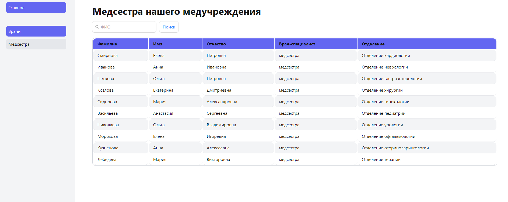

## Разработан сайт для учета работников медучреждения с использованием (React + TypeScript + Vite + Tailwindcss)



#### Для запуска проекта необходимо прописать в терминале следующие команды:

- Склоинровать данный репозиторий -

```bash
git clone https://github.com/Shaihali/medical-facility.git
```

- Установить все зависимости -

```bash
npm install
```

- Запустить проект

```bash
npm run dev
```

<br><br><br>_Приятного просмотра!!! )))_
